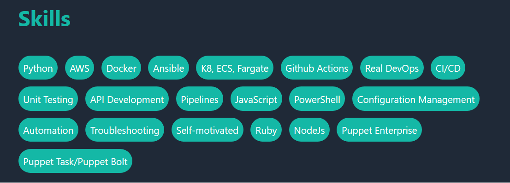

# Resume/CV Template

In an effort to learn react, I decided to create a personal website for my resume. During the process, I figured it would be cool to make the project public in hopes others might find it as a useful starting point.

You can find my personal website that is currently using this template [here](https://ffalor.dev).

## Dependencies

The project uses [next.js react framework](https://nextjs.org/) and [tailwind css](https://tailwindcss.com/) for styling.

## How to use

1. Fork and Clone this repo
2. Modify the configuration file `./public/resumeData.json` with your resume information.
3. Run `yarn start`

## Deployment

I am currently using [Vercel](https://vercel.com). Vercel was created by the same people who created nextjs. It is a quick and free way to host your resume. [Github Pages](https://pages.github.com/) is another great option.

## Configuration

The `resumeData.json` file is the starting point for this template. You do not have to write any code to take this template and deploy your own resume website.

The website consists of multiple react components, and the content of each component is dynamically created from the data inside `resumeData.json`

Example:

The `skills` section of the configuration file will generate block of tag styled elements. You can provide an unlimited number of skills inside the json file and the website will render them all in the order they are listed.

The skills array for my resume looks like this

```json
    "skills": [
      "Python",
      "AWS",
      "Docker",
      "Ansible",
      "K8, ECS, Fargate",
      "Github Actions",
      "Real DevOps",
      "CI/CD",
      "Unit Testing",
      "API Development",
      "Pipelines",
      "JavaScript",
      "PowerShell",
      "Configuration Management",
      "Automation",
      "Troubleshooting",
      "Self-motivated",
      "Ruby",
      "NodeJs",
      "Puppet Enterprise",
      "Puppet Task/Puppet Bolt"
    ]
```

The above array will result in the following view:



## Known issues

This is heavy WIP, most of the website was written in a few hours.

## Getting help

If you have questions, concerns, bug reports, etc, please file an issue in this repository's Issue Tracker.

## Contributions

Feel free to fork and purpose changes to the template.
  